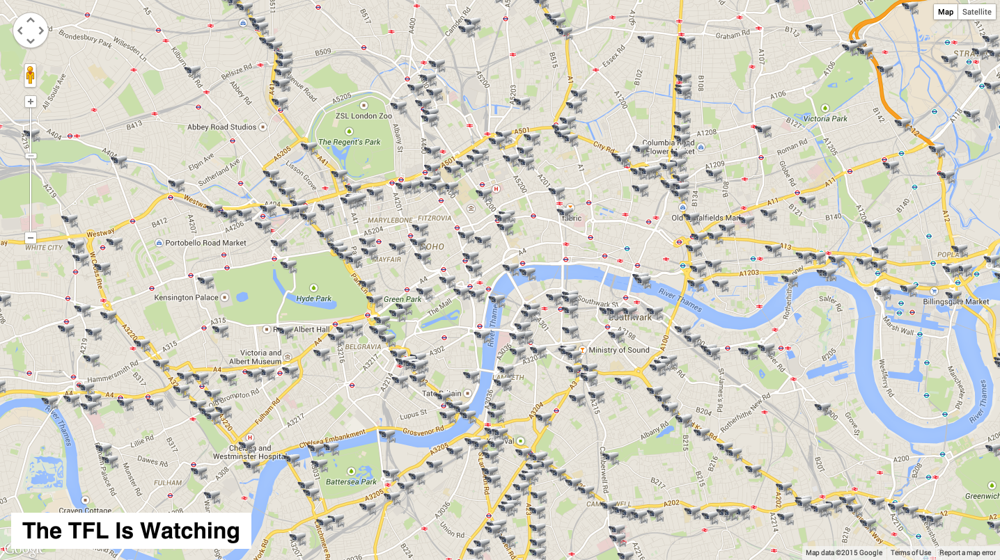

# [TFL Cameras](https://tflcameras.firebaseapp.com/)

 

An applicaton displaying all of the TFL cameras around London and their last saved image.

## Features

### Build With React, Google Maps API, & TfL API